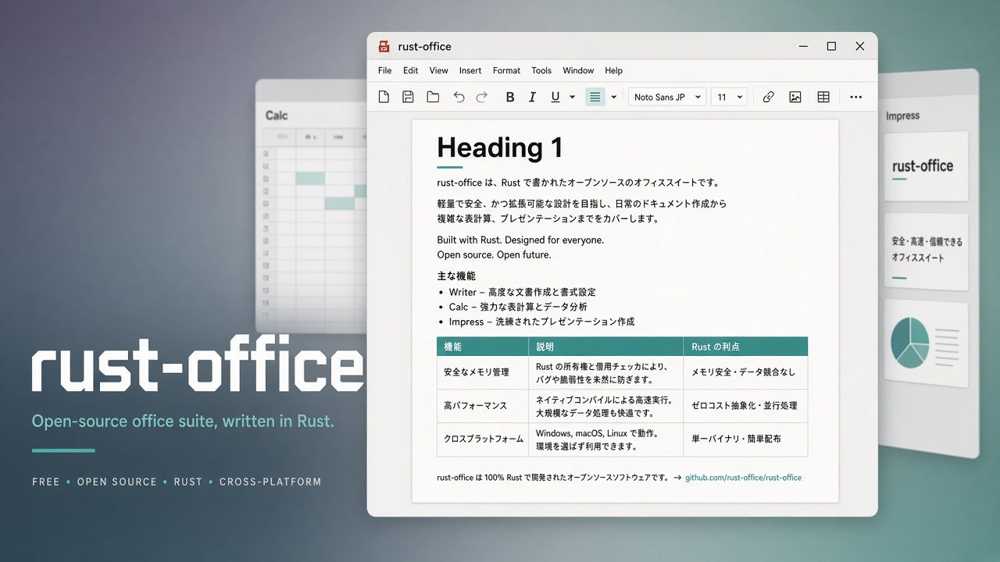

# rust-office

<p align="center">
  
</p>

<p align="center">
  <strong>A modern, cross-platform office suite written in Rust</strong><br>
  Native Writer · Calc · Impress — aiming at LibreOffice / Microsoft Office class fidelity
</p>

<p align="center">
  <a href="https://github.com/rsasaki0109/rust-office/actions/workflows/ci.yml"></a>
  
  
</p>

---

The long-term goal of **rust-office** is a fast, native, open-source alternative to LibreOffice and Microsoft Office — one shared Rust core, one binary, three apps.

## Quick start

```bash
cargo run --locked -p office-ui
```

Requirements: Rust 1.99+, a CJK font recommended for Japanese (e.g. Noto Sans CJK), and usual egui/eframe Linux GUI deps.

```bash
cargo test --locked --workspace
cargo clippy --locked --workspace --all-targets -- -D warnings
```

## Project goals

* Native performance with a Rust-first architecture
* Cross-platform: Windows, Linux, and macOS
* Clean separation between GUI, document model, rendering, and file formats
* Shared core powering Writer, Calc, and Impress
* Interchange-friendly formats (JSON / ODT / DOCX / XLSX / PPTX / PDF)
* Incremental delivery: ship real apps early, deepen fidelity continuously

## Current status (45% of the daily-use roadmap)

The [90% roadmap](docs/ROADMAP_90.md) tracks 20 acceptance milestones for daily
use across Writer, Calc, Impress, data protection, and distribution. This is a
project milestone score, not a measure of full Microsoft Office / LibreOffice
compatibility. Unmerged work is tracked separately.

### Writer

* Office-like chrome: menus, toolbar, A4 canvas, status bar
* Editing: typing, selection, clipboard, undo/redo, IME preedit
* Styles: Bold / Italic / Underline, font size, alignment, Normal / Heading 1–3
* Page layout: multi-page A4, page breaks, section breaks, header/footer (`{page}` / `{pages}`)
* Tables, images, lists (incl. nested), hyperlinks
* Open/save: `.roffice.json`, `.odt`, `.docx` (MVP round-trips)
* Print / Export PDF from on-screen layout (embedded images)

### Calc

* Sparse grid UI, A1 refs, `+ − * /`, `SUM` / `AVERAGE` / `MIN` / `MAX` / `IF` / `COUNT`
* CSV + XLSX open/save (multi-sheet)
* Rectangular selection (drag / Shift+arrow / Shift+click), tabular copy/cut/paste
* Formula copies adjust relative, absolute and mixed A1 references (including ranges)
* Literal text input with `'`; XLSX keeps numeric/formula-shaped text and error values
* Undo/Redo for cell edits, range operations and adding sheets; save state tracking

### Impress

* Slides, Light / Dark / Ocean themes
* JSON + PPTX open/export (title + body MVP)

### Platform

* GitHub Actions CI (test + clippy) and Linux release artifact
* CJK fonts + IME hooks (platform-dependent)

### GUI: egui + eframe

Chosen for a custom page canvas today and a future Calc grid, while keeping a pure-Rust single binary. See the comparison notes in older docs history if you care about iced / Slint / Tauri trade-offs.

## Architecture

```text
rust-office/
  crates/
    office-core/    # Document model, selection, editing, undo/redo (GUI-free)
    office-calc/    # Spreadsheet model, formulas, CSV / XLSX
    office-impress/ # Presentation model, themes, PPTX
    office-format/  # JSON + ODT + DOCX + PDF
    office-render/  # Page layout, hit-testing, layout-faithful PDF
    office-ui/      # egui Writer + Calc + Impress (`rust-office`)
```

## What is still missing

* Per-section page styles in DOCX/ODT (export currently flattens with page breaks)
* Named styles beyond Heading 1–3; floating images; footnotes
* Exact PDF glyph metrics / richer table borders
* Calc charts / full Excel function library
* Impress shapes beyond title+body / animations
* Spell check; full accessibility tree
* Signed Win / macOS installers

### Next recommended work

1. Richer multi-section page styles + true DOCX `sectPr` / ODT master pages
2. Multi-OS packaging + accessibility stubs
3. Calc charting MVP / Impress richer shapes

## Contributing

* Keep GUI code out of `office-core` so editing stays unit-testable
* Prefer small, reviewable PRs focused on one subsystem
* Add/extend tests for model, editing, undo/redo, and serialization
* Avoid `unsafe` unless there is a clear, documented need

## License

Licensed under either of

* Apache License, Version 2.0, or
* MIT license

at your option.

See [LICENSE-MIT](LICENSE-MIT) and [LICENSE-APACHE](LICENSE-APACHE).
